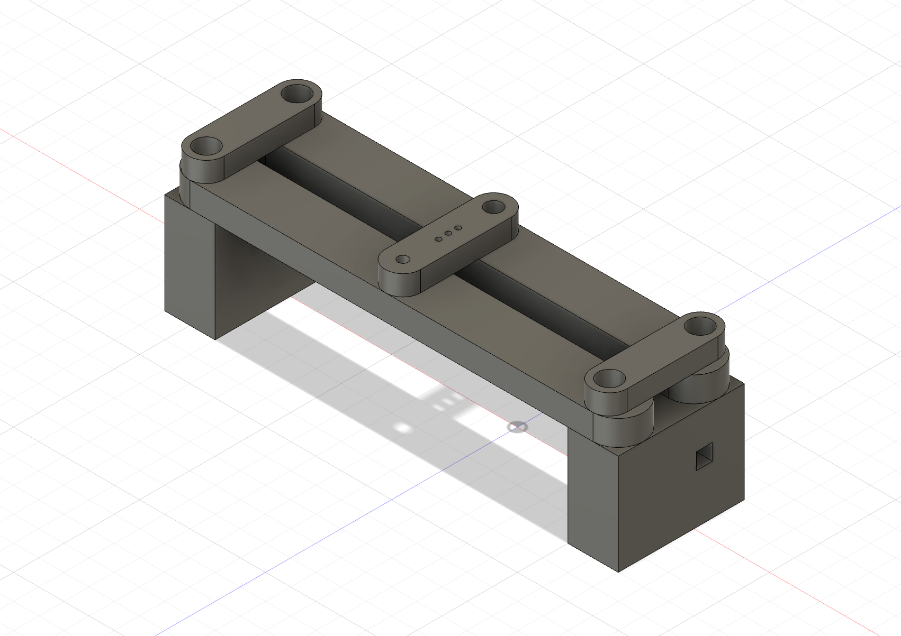
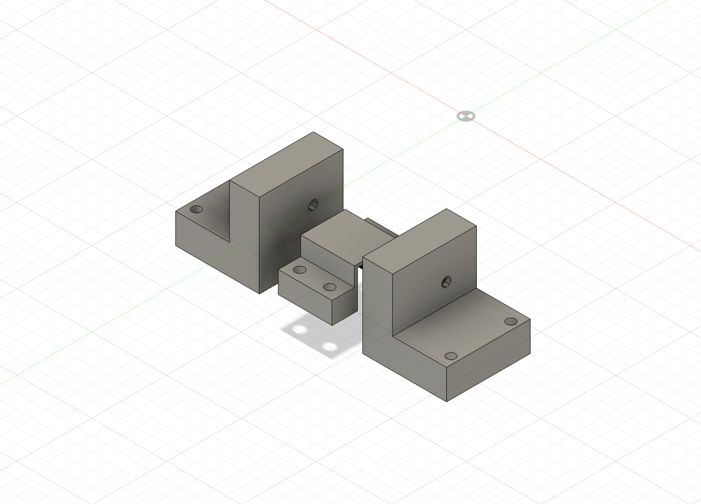
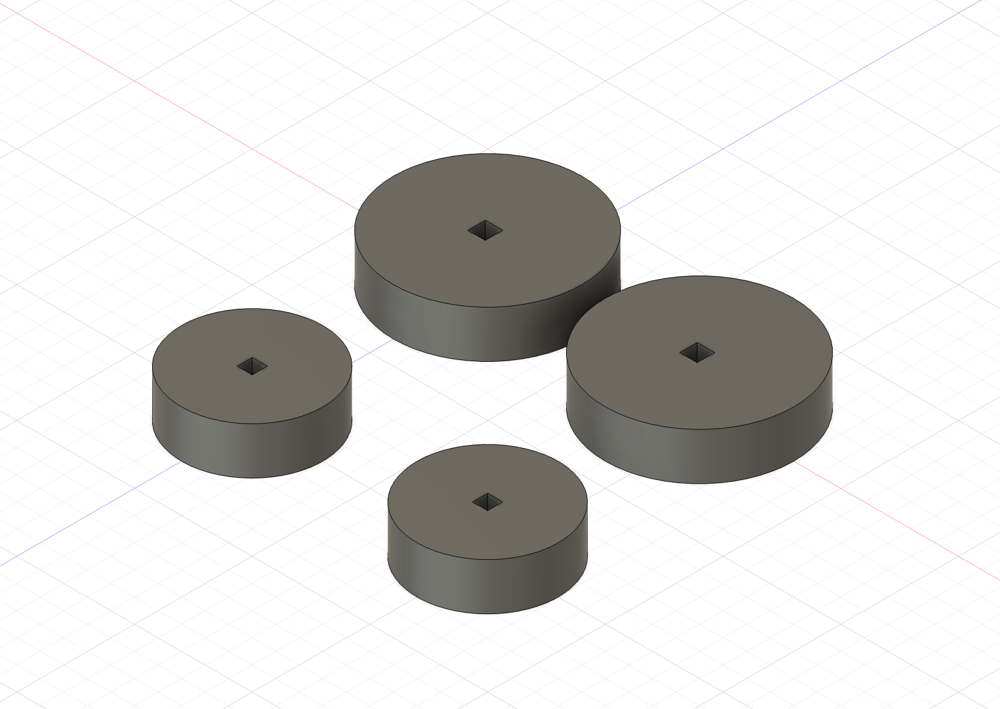
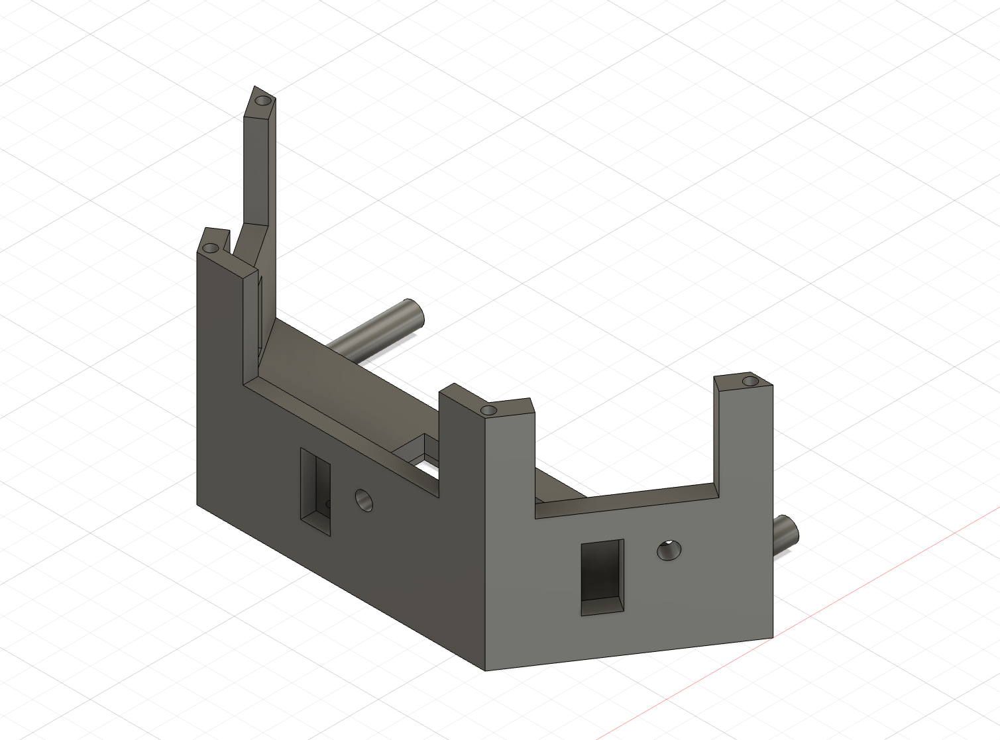
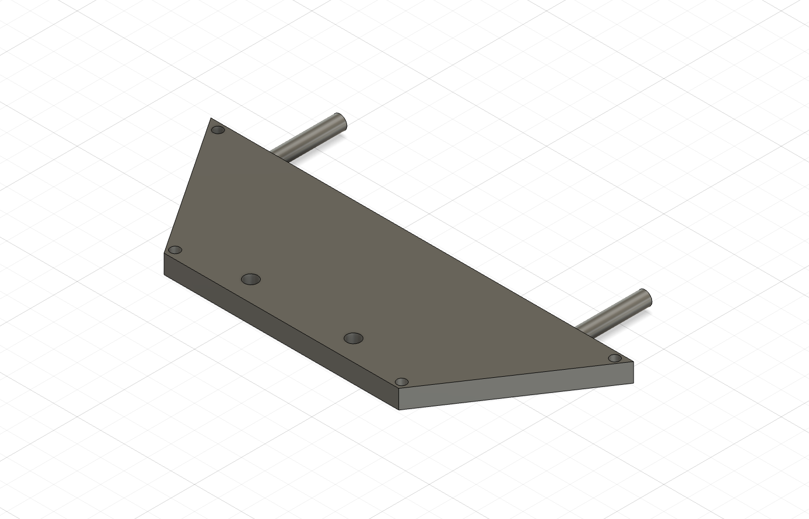
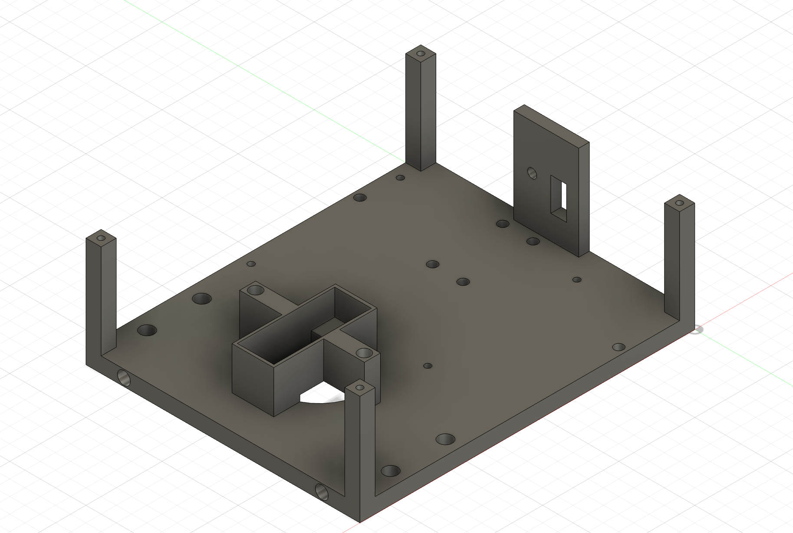
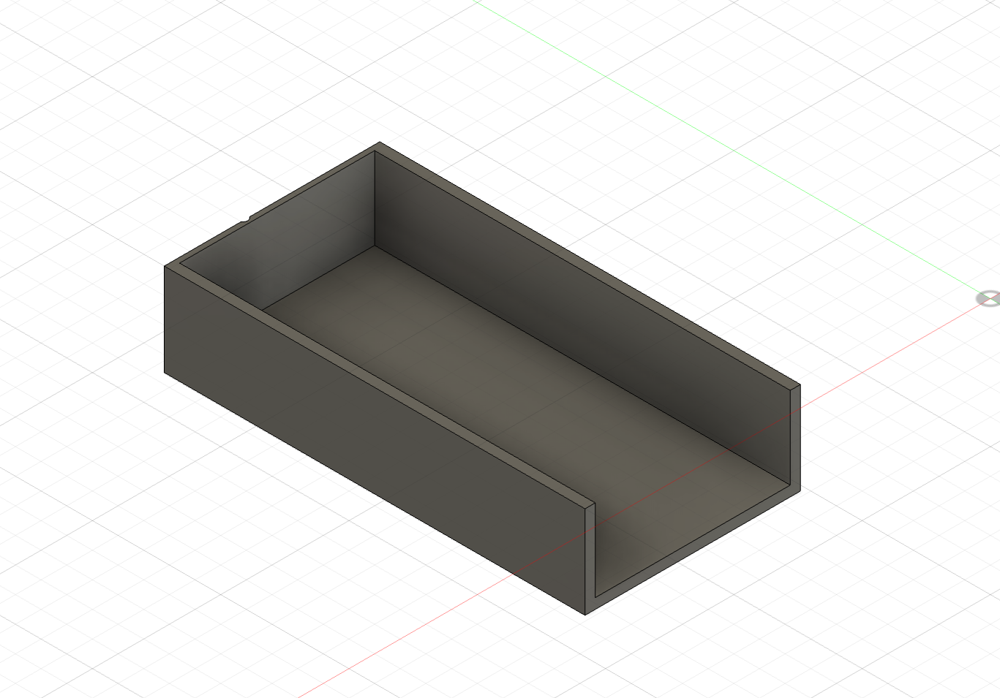

<h1 align="center">Tricky Trio &middot; WRO 2026 Future Engineers</h1>

<!-- TODO: add a wide hero photo of the finished robot on the mat -->

---

## Table of Contents

1. [The Team](#1-the-team)
2. [Design Philosophy](#2-design-philosophy)
3. [Components](#3-components)
4. [Mobility and Mechanical Design](#4-mobility-and-mechanical-design)
5. [3D Models and Printed Parts](#5-3d-models-and-printed-parts)
6. [Power and Sensor Architecture](#6-power-and-sensor-architecture)
7. [Software Architecture](#7-software-architecture)
8. [Parking Strategy](#8-parking-strategy)
9. [Videos](#9-videos)
10. [Acknowledgements](#10-acknowledgements)

---

## 1. The Team

<!-- TODO: add the photos to t-photos/ and check the filenames match -->

| | Who we are |
|---|---|
|  | **Aditya Juneja**<br><br>Grade 10. Interested in computer science and robotics, and the part of engineering where a plan on paper turns into something that actually moves. Outside of this, football and track and field, and picking up whatever new thing looks worth learning. |
|  | **Ishayu Datta**<br><br>Grade 10. Interested in engineering and robotics, and in understanding why a design works rather than just that it does. Outside of this, swimming and playing guitar. |
|  | **Sarjas Gauhar Singh**<br><br>Grade 10. Interested in robotics and computer science, and in the hands-on side of building. Outside of this, guitar and playing in bands, and football. |
|  | **Coach**<br><br>*To be filled in.* |

**Country:** India &nbsp;&nbsp;&middot;&nbsp;&nbsp; **Team photos:** [`t-photos/`](t-photos/)

### What We Learned

None of us had built a robot at this level before, and most of what we learned came
from things not working the first time.

**CAD and 3D design.** We designed the chassis, the steering assembly, the motor mount,
the battery holder and the wheels ourselves in Fusion 360, then printed and reprinted
them. Learning to design a part that can actually be printed, with the right tolerances
for a bearing or a screw, took several attempts per part.

**Electrical wiring and soldering.** We went from loose jumper wires to a planned
connection list and a proper PCB layout. Along the way we learned to read a datasheet
for voltage limits rather than assuming, why grounds have to be common, and why a
decoupling capacitor sits next to the thing it protects rather than anywhere convenient.

**Software architecture.** Writing code that a teammate can read months later turned
out to be a separate skill from writing code that works. We ended up splitting the
system into modules that each do one job, so a change to how the camera works cannot
break how the robot steers.

**Working as a team.** Three people editing the same project needed version control,
clear ownership of each subsystem, and the discipline to write down decisions instead
of remembering them.

---

## 2. Design Philosophy

Four principles we set before writing any code, and kept to. Every one of them exists
because of a specific problem we expected to hit.

**Split the work by timing requirement, not by convenience.**
The Raspberry Pi runs Linux, which is not a real time operating system. A background
process, a filesystem write or a Wi-Fi interrupt can stall a Python loop for tens of
milliseconds. That is invisible when you are processing a photo, and disastrous when a
servo is waiting for its next pulse. So the rule became: anything with a deadline runs
on the Pico, anything that needs to think runs on the Pi. The cost is a serial link
between them and the discipline of keeping a clear interface. What we get back is a
steering loop that cannot be interrupted by the camera.

**Make every module testable without the robot.**
Hardware is slow to test, easy to break, and often unavailable when you want to work.
So every file in this project runs a self test on a laptop with nothing plugged in. The
microcontroller modules are written so their hardware imports fail harmlessly off the
board, which leaves the maths behind them importable. This is why we could debug the
steering geometry and the orientation conversion weeks before the chassis was finished,
and why a change to one module tells us immediately if it broke another.

**Keep decisions in tables, not buried in conditionals.**
The robot's entire competition behaviour is one table of states and events. Anyone can
read what the robot does in each situation without following code paths through nested
if statements. When we improve how the robot detects a corner, we change how that event
is produced and the behaviour table never needs to know.

**Prefer something tunable over something optimal.**
A competition venue is a bad place to tune anything complicated. Where we had a choice
between a more sophisticated algorithm with several interacting constants and a simpler
one with a single gain, we took the simpler one. Being able to adjust the robot
confidently between rounds is worth more than a theoretically better response we cannot
reason about under pressure.

---

## 3. Components

<!-- TODO: add photos to v-photos/Components/ and fill any blank values.
     Blanks are values we have not measured or confirmed from a datasheet yet.
     Verify the filled figures against your own parts before relying on them. -->

### Raspberry Pi 3 Model B


**What it does.** Runs the camera and everything that needs to think: the vision
pipeline that finds traffic signs and parking markers, the navigation engine that
decides speed and steering, and the state machine that tracks what the robot is doing.
Chosen because computer vision needs an operating system, a filesystem and real RAM,
none of which a microcontroller has.

| Specification | Value |
|---|---|
| Processor | Broadcom BCM2837, quad core Cortex-A53 |
| Clock speed | 1.2 GHz |
| RAM | 1 GB LPDDR2 |
| Supply voltage | 5 V |
| Recommended supply current | 2.5 A |
| GPIO logic level | 3.3 V |
| Camera interface | 15 pin CSI-2 |
| Measured current draw, running vision | |

### Raspberry Pi Pico 2 W


**What it does.** Runs everything with a deadline: the motor, the steering servo, the
wheel encoder and all six sensors. It also holds the safety watchdog, which stops the
robot if the Pi goes quiet for half a second.

| Specification | Value |
|---|---|
| Microcontroller | RP2350 |
| Cores | Dual Cortex-M33 |
| Clock speed | 150 MHz |
| SRAM | 520 KB |
| Flash | 4 MB |
| VSYS input range | 1.8 to 5.5 V |
| Logic level | 3.3 V, not 5 V tolerant |
| Measured current draw | |

### Camera Module 3


**What it does.** The only sensor that can tell red from green, and the only one that
sees far enough ahead to plan a manoeuvre rather than react to one. It also finds the
magenta parking markers and the black wall.

| Specification | Value |
|---|---|
| Sensor | Sony IMX708 |
| Full resolution | 11.9 MP, 4608 x 2592 |
| Resolution used | 640 x 480 |
| Horizontal field of view | 66 degrees, standard lens |
| Focus | Autofocus |
| Connector | 15 pin FPC |
| Mounting height above mat | |
| Mounting angle | |

### GA12-N20 Gear Motor with Encoder


**What it does.** Single drive motor on the rear axle. The built in encoder is the
important part: it lets us measure how far the wheels have actually turned, rather than
assuming the motor did what we asked. Without it the robot cannot tell that it is
stuck.

| Specification | Value |
|---|---|
| Rated voltage | 6 V |
| Encoder pulses per motor revolution | 7 |
| Gear ratio | |
| No load speed at the output shaft | |
| Stall torque | |
| Stall current | |
| Pulses per wheel revolution | |

### MG90S Servo


**What it does.** Turns the front wheels through the Ackermann linkage. Metal geared,
so the gear train survives clipping a wall, which is what destroys plastic geared
servos.

| Specification | Value |
|---|---|
| Operating voltage | 4.8 to 6.0 V |
| Stall torque | 1.8 kg-cm at 4.8 V, 2.2 kg-cm at 6 V |
| Operating speed | 0.1 s per 60 degrees at 6 V |
| Gear material | Metal |
| Control signal | 50 Hz PWM |
| Pulse width range used | 1000 to 2000 microseconds |
| Steering range achieved | |

### DRV8833 Motor Driver


**What it does.** Sits between the Pico and the motor. The Pico's pins can supply a few
milliamps; the motor needs hundreds. The driver takes a logic level signal and switches
the battery voltage across the motor, and it controls direction as well as speed.

| Specification | Value |
|---|---|
| Motor supply range | 2.7 to 10.8 V |
| Continuous current per channel | 1.5 A |
| Peak current per channel | 2 A |
| Logic input | 3.3 V compatible |
| PWM frequency used | 20 kHz |
| Control method | PWM on one input sets direction and speed |

### VL53L0X Time of Flight Sensor


**What it does.** Four of these measure distance by timing a laser pulse. One faces
forward for corner detection, two face the forward diagonals for lane position, and one
faces backward. Unlike ultrasonic sensors they are unaffected by sound, and unlike the
camera they work regardless of colour.

| Specification | Value |
|---|---|
| Quantity | 4 |
| Measuring range | 30 to 2000 mm |
| Emitter | 940 nm VCSEL laser |
| Field of view | 25 degrees |
| I2C address | 0x29, fixed |
| Supply voltage | 3.3 V |
| Default timing budget | 33 ms per reading |
| Mounting angles | 0, minus 45, plus 45, 180 degrees |

### TCA9548A I2C Multiplexer


**What it does.** Solves a specific problem: every VL53L0X has the same fixed I2C
address, and so does the colour sensor. Put two on one bus and both answer at once. The
multiplexer connects one channel at a time, so each sensor gets the bus to itself.

| Specification | Value |
|---|---|
| Channels | 8 |
| Channels used | 6 |
| Address range | 0x70 to 0x77 |
| Address used | 0x70 |
| Supply voltage | 3.3 V |
| Bus speed used | 400 kHz |

### BNO085 IMU


**What it does.** Tells us which way the robot is pointing. This is how we know a
90 degree turn is finished, and how we hold a straight line between corners. It runs
sensor fusion on its own processor, so it hands over a finished orientation rather than
raw values to filter ourselves.

| Specification | Value |
|---|---|
| Sensors | 3 axis accelerometer, gyroscope and magnetometer |
| Output used | Rotation vector, as a quaternion |
| Supply voltage | 3.3 V |
| I2C address | 0x4A, or 0x4B if the jumper is bridged |
| Multiplexer channel | 2 |
| Polling rate used | 20 Hz |
| Heading accuracy | |

### TCS34725 Colour Sensor


**What it does.** Reads the colour of the mat directly underneath the car, which is how
we detect the orange and blue corner lines. Its built in infrared filter is why it stays
accurate while four infrared distance sensors are firing next to it.

| Specification | Value |
|---|---|
| Output channels | Red, green, blue and clear |
| Infrared filter | On die |
| Supply voltage | 3.3 V |
| I2C address | 0x29, fixed |
| Multiplexer channel | 1 |
| Gain options | 1x, 4x, 16x, 60x |
| Gain used | 4x |
| Integration time used | 50 ms |
| Mounting height above mat | |

### Mini560 Buck Converter


**What it does.** Steps the battery voltage down to a steady 5 V for the Pi, the Pico
and the servo. A buck converter rather than a linear regulator because it wastes far
less energy as heat, which matters when the Pi alone can draw over two amps.

| Specification | Value |
|---|---|
| Input voltage range | 4.5 to 20 V |
| Output voltage | 5 V |
| Maximum output current | 5 A |
| Efficiency | Up to 97 percent |
| Measured output under full load | |

### Battery


**What it does.** Powers everything. Chosen for a high discharge rating, since the peak
draw when the servo hits full lock while the motor is accelerating is several times the
average.

| Specification | Value |
|---|---|
| Chemistry | 2S1P LiPo |
| Nominal voltage | 7.4 V |
| Capacity | 1500 mAh |
| Discharge rating | 35C |
| Stored energy | 11.1 Wh |
| Mass | |
| Measured run time | |

---

## 4. Mobility and Mechanical Design

### Chassis

| Property | Value | Why |
|---|---|---|
| Length | 15.0 cm | The parking slot is 1.5 times the robot length, so every centimetre of car costs 1.5 cm of slot. Short is safe. |
| Width | 10.5 cm | The lane is 100 cm wide. Narrow enough to pass a sign with margin either side. |
| Drive | Single motor, rear axle | The rules require the drive wheels to be physically connected. One motor through a gearbox satisfies this and removes differential speed error. |
| Steering | Ackermann, front axle, one servo | Required by the category focus on kinematics other than differential drive. |

### Why This Motor

The GA12-N20 was chosen for three reasons, in order of weight.

**The built in encoder was the deciding factor.** It lets us measure actual wheel
rotation instead of assuming that PWM duty maps cleanly to speed. Without odometry we
cannot detect a stalled robot, and stall detection is what triggers our recovery
behaviour. A robot that is wedged against a wall and does not know it will sit there
until the round ends.

Second, the integrated gearbox fits a package small enough for a 15 cm chassis. Third,
it runs at 6 V, matching the rest of the low voltage system.

**Torque and speed reasoning.** Theoretical top speed follows the relation between
wheel circumference and output shaft revolutions per minute. That figure ignores load,
rolling resistance and battery sag, so we treat it as an upper bound rather than a
target, and tune the operating speed experimentally instead.

<!-- TODO: measure these on the bench and fill them in. Do not estimate.
| Measurement | Value |
|---|---|
| Measured top speed, wheels off the ground | |
| Measured top speed, on the mat | |
| Lowest PWM percentage that actually moves the robot | |
| Time to travel 1 m from standstill | |
| Measured turning radius at full lock | |
-->

**Why not two motors, one per side?** Explicitly forbidden by the rules. It would also
have introduced differential error that our single encoder cannot see.

### Ackermann Steering



We use an **Ackermann steering geometry** on the front axle, driven by a single servo
through a track rod.

The problem Ackermann solves is that when a car turns, the inside wheel travels a
tighter circle than the outside wheel. If both front wheels were held parallel, one of
them would have to scrub sideways through every corner, which wastes energy, wears the
tyre and makes the turn unpredictable. Ackermann geometry angles the steering arms so
the inside wheel turns through a **larger** angle than the outside one, letting both
wheels roll cleanly around a common centre.

For this robot that matters for two reasons. The corners are tight, so the difference
between the two wheel angles is significant rather than negligible. And our odometry
comes from the driven rear wheels, so anything that makes the front wheels scrub
introduces error into how far we think we have travelled.

The full assembly is in
[`models/front-steering/`](models/front-steering/) as a Fusion 360 file.

### Steering Control

The servo angle is converted to a pulse width from a calibrated centre position, with
three deliberate safety features.

The centre position is calibrated per build, because no two linkages sit neutral at the
same pulse width. A direction constant flips the sign if the servo is mounted mirrored,
so a mounting error is fixed with a constant rather than by negating in the code, and
the sign convention stays identical on both controllers.

Most importantly, the angle is clamped to plus or minus 30 degrees before conversion,
and the resulting pulse is clamped again to a safe range. A runaway command therefore
cannot drive the servo into the steering linkage and stall it. A stalled MG90S draws
over an amp and destroys its own gears in about a minute.

---

## 5. 3D Models and Printed Parts

Every structural part on this robot was designed by us and printed or fabricated in
house. Source files are in [`models/`](models/), organised by subsystem, each with the
CAD file and a render.

### Front Steering Assembly


Holds the two front wheels, the steering knuckles and the track rod that connects them
to the servo horn. The geometry of the steering arms is what produces the Ackermann
angle difference described above, so this part had the tightest tolerances of anything
we designed.

[`Ackerman System vinfinity.f3d`](models/front-steering/Ackerman%20System%20vinfinity.f3d)

### Rear Drive Mount



Holds the GA12-N20 motor rigidly in line with the rear axle. Rigidity matters more than
it looks: any flex here shows up as inconsistent odometry, because the encoder counts
motor revolutions while the wheel is what actually moves the robot.

[`rear_motor_mount.step`](models/rear-drive/rear_motor_mount.step)

### Wheels



Designed to a diameter that keeps the chassis low while giving enough ground clearance
for the mat. Wheel diameter feeds directly into every distance the robot calculates, so
this dimension is measured under load rather than taken from the model.

[`wheels.f3d`](models/wheels/wheels.f3d)

### Chassis Body

The body is printed in four sections so each fits the print bed and can be replaced on
its own without reprinting the whole car.

| Part | Render | Files |
|---|---|---|
| Front lower |  | [`front down.stl`](models/body/front_down/front%20down.stl) |
| Front upper |  | [`front top.stl`](models/body/front_top/front%20top.stl) |
| Rear lower |  | [`back down.stl`](models/body/back_down/back%20down.stl) |
| Rear upper | <!-- TODO: add back_top image and STL --> *to be added* | [`back_top/`](models/body/back_top/) |

### Battery Mount



Holds the LiPo low and central. Battery position affects weight distribution, which
affects how much grip the driven rear wheels have, so it is mounted as low as the
chassis allows.

[`battery_mount.stl`](models/body/battery_mount/battery_mount.stl)

<!-- TODO: worth adding if you have the information
| Print setting | Value |
|---|---|
| Material | |
| Layer height | |
| Infill | |
| Supports | |
-->

---

## 6. Power and Sensor Architecture

Wiring diagrams are in [`schemes/`](schemes/), with the complete master connection list
in [`schemes/README.md`](schemes/README.md).

### Power Budget

| Consumer | Typical | Peak | Notes |
|---|---|---|---|
| Raspberry Pi 3 | ~700 mA | ~2.5 A | Peaks during vision processing |
| MG90S servo | ~200 mA | ~1.5 A | Peak at stall or full lock |
| GA12-N20 motor | ~150 mA | ~800 mA | Peak at stall |
| Pico 2 W and sensors | ~150 mA | ~200 mA | Six I2C devices on the 3.3 V rail |
| **Total** | **~1.2 A** | **~5 A** | |

The peak figure is the one that matters. The Pi browns out and reboots if the 5 V rail
sags, and it sags exactly when the servo slams to full lock, which is precisely when
the robot is doing something difficult. Our mitigations are a 100 uF electrolytic
capacitor across the motor driver's supply pins at the driver itself, and a 0.1 uF
ceramic capacitor across the motor terminals to suppress brush noise.

### Sensor Placement

<!-- TODO: add a top down diagram showing sensor positions and angles. -->

| Sensor | Quantity | Placement | Why here |
|---|---|---|---|
| Camera Module 3 | 1 | Front, elevated | Height gives earlier sight of signs, and it is the only sensor that distinguishes colour |
| VL53L0X | 1 | Front, 0 degrees | Corner confirmation and collision avoidance |
| VL53L0X | 2 | Plus and minus 45 degrees, flanking the camera | Lane position and corner geometry |
| VL53L0X | 1 | Rear, 180 degrees | Parking and reversing clearance |
| BNO085 | 1 | Centre, mounted flat | Heading for turn completion and straight line hold |
| TCS34725 | 1 | Underside, 5 to 10 mm above the mat | Corner line detection |

**Why 45 degrees and not 90?** This is the placement decision we spent longest on.
Sensors pointing straight out to the sides tell you the lane width, but they only see a
corner once you are already level with it, which is too late to plan a turn. At 45
degrees they watch the forward diagonals, so an approaching inner wall shows up while
there is still room to react.

The cost of that choice is that a reading is no longer lateral clearance. A reading of
D millimetres at 45 degrees means roughly 0.71 times D ahead and the same again to the
side. That conversion is documented in the distance module, because anything that
treats a diagonal reading as lateral clearance will drive the robot into a wall.

Lane position then falls out of comparing the two diagonals against each other, which
needs no knowledge of the lane width at all. More room on the right means the car has
drifted left, so it steers right.

**A failure point we designed around.** A VL53L0X reports roughly 8190 mm when it sees
nothing at all. Fed into that comparison this looks like an enormously wide lane, so
readings above 2000 mm are discarded rather than believed.

### Why a Multiplexer

Every VL53L0X ships with the same fixed I2C address, and so does the colour sensor. Put
two on one bus and both answer at once, and nothing in software can separate them.

There are two ways out. One is to pulse each sensor's shutdown pin at boot to bring
them up one at a time and reassign addresses. The other is to switch the bus. We chose
the TCA9548A multiplexer because it needs no extra GPIO pin per sensor and no boot time
sequencing that can fail silently.

| Multiplexer channel | Device |
|---|---|
| 0 | VL53L0X front |
| 1 | TCS34725 colour |
| 2 | BNO085 IMU |
| 3 | VL53L0X left |
| 4 | VL53L0X right |
| 5 | VL53L0X rear |

The cost is that reads are sequential: switch channel, talk, switch channel, talk. A
full sweep of four distance sensors costs about 132 ms, which is why the Pico applies
commands every 20 ms but sweeps sensors only every 150 ms. A single speed loop would
have delayed every motor command by the length of a sensor sweep.

---

## 7. Software Architecture

```
   +---------------- Raspberry Pi 3 ----------------+   +---- Pico 2 W ----+
   |                                                |   |                  |
   |  camera --> vision --> signs, wall, slot --+   |   |  motionController|
   |                                            |   |   |    servo         |
   |  robot_state --> mission --> navigation ---+   |   |    motor driver  |
   |                             (HOW to drive) |   |   |                  |
   |                          state machine ----+---+---+--> "45,23"       |
   |                          (WHAT we are doing)   |   |                  |
   |                                                |   |  sensorManager   |
   |  robot_state <---------------------------------+---+-- "S,480,230..." |
   +------------------------------------------------+   +------------------+
```

Each frame runs these seven steps, in this exact order.

| Step | What happens | Module |
|---|---|---|
| 1 | Capture a frame | `main.py` |
| 2 | Detect signs, wall and parking markers | `vision_test.py` |
| 3 | Read the newest robot state from the Pico | `main.py` |
| 4 | Ask which challenge is active | `mission_manager.py` |
| 5 | Decide **how** to drive, meaning speed and steering | `navigation_engine.py` |
| 6 | Decide **what** we are doing, and restrain the command | `state_machine.py` |
| 7 | Send the final command over UART | `main.py` |

**The separation that makes this work.** Navigation decides how to drive. The state
machine decides what we are doing, and it may only restrain navigation's request, never
invent one of its own. Cornering caps the speed lower than the straights. Recovery caps
it lower still. Finishing caps it to zero.

Only the coordinator writes to the serial port, and it writes only the state machine's
output, so there is exactly one place in the whole system where a command can reach the
wheels.

### The State Machine

**Twelve states, seventeen events, thirty transitions, three missions.**

The critical design choice is that detecting what happened is separate from deciding
what to do about it. One function turns sensor readings into named events, and it is
the only place that knows about millimetres and degrees. A separate table maps each
state and event to the next state, and that table contains no numbers at all.

Row order within the table is priority. When a wall and a sign are both visible, the
wall wins, and that is a line you can point at rather than a consequence of which if
statement happened to come first.

States: `WAIT_FOR_START`, `INITIALISE`, `FOLLOW_COURSE`, `APPROACH_PILLAR`,
`PASS_PILLAR`, `RECENTER`, `TURN_CORNER`, `SEARCH_PARKING`, `ALIGN_PARKING`,
`ENTER_PARKING`, `RECOVERY`, `FINISHED`.

### Vision Pipeline

Cost per frame is linear in the number of pixels and linear in the number of contours
found, and the pixel count is fixed by the processing width rather than the camera
resolution. The pipeline measures 0.32 ms per frame on a development laptop, which
means the camera frame rate is the ceiling rather than the code.

| Stage | Detail |
|---|---|
| Region of interest | Top 35 percent discarded, since only ceiling and lights live up there |
| Downscale | Detection runs at 320 pixels wide, drawing stays at full resolution |
| Colour threshold | Red needs two hue ranges because hue wraps around zero |
| Morphology | Open to remove speckle, close to fill glare holes |
| Contour filter | Area, aspect ratio and fill ratio together |

**Why the fill ratio matters.** Taking the largest contour locks onto a red jacket in
the audience or a stripe of glare on the mat. A real traffic sign fills its bounding
box, and scattered reflections do not. A candidate must pass area, aspect ratio and
fill ratio before it is believed.

**Distance from a single camera.** Signs are a known 10 cm tall, so the ratio of real
height to pixel height gives range without a stereo rig.

---

## 8. Parking Strategy

The parking lot is bounded by two magenta elements measuring 20 by 2 by 10 cm. The slot
is 20 cm wide and 1.5 times the robot's length, which for our 15 cm car means 22.5 cm.

### Magenta Against Red

Magenta sits immediately below red on the hue circle. Our original upper red band
started low enough that it **swallowed the magenta markers entirely**, and the robot
saw the parking lot as a giant traffic sign and tried to pass it on the right. The red
band now starts higher, which costs nothing because red's main band sits at the other
end of the scale.

### Aiming at the Gap

The vision module returns the midpoint between the markers' inner edges, which is the
slot itself rather than either marker. Both markers must be visible before the robot
commits, because you cannot aim at a gap you can only half see.

The sequence is `SEARCH_PARKING`, then `ALIGN_PARKING`, then `ENTER_PARKING`, then
`FINISHED`.

### Two Problems This Sequence Taught Us

**We were watching the wrong sensor.** Our first version stopped when the rear distance
sensor read close. But the camera faces forward, so the slot is only visible while
driving at it, meaning the robot enters nose first and the rear sensor is pointed back
at the open mat it came from. It never triggered, and the robot stopped on a timeout
rather than on arrival.

**The stop was then physically unreachable.** Navigation performs an emergency stop at
150 mm, but the parking trigger sat at 120 mm, so the robot froze before it could ever
reach its own trigger. The fix was a minimum speed for the entry phase, together with a
threshold below the emergency stop line, and a check that enforces that ordering so it
cannot silently break again.

---

## 9. Videos

<!-- TODO: replace with real links. Each video must show at least 30 seconds of
     autonomous driving, and one is required for each challenge. -->

| Round | Link |
|---|---|
| Open Challenge | *YouTube URL* |
| Obstacle Challenge | *YouTube URL* |

Also recorded in [`video/`](video/).

---

## 10. Acknowledgements

<!-- TODO: your school, mentors and sponsors -->

Open source work we build on: OpenCV, MicroPython, and the MicroPython drivers for the
VL53L0X, BNO08x and TCS34725 sensors. We also studied the public repositories of
previous WRO Future Engineers teams. The category's culture of publishing work openly
is the reason this repository exists in the form it does.

---

<p align="center">
  <b>Team Tricky Trio</b> &middot; India &middot; WRO 2026 Future Engineers
</p>
