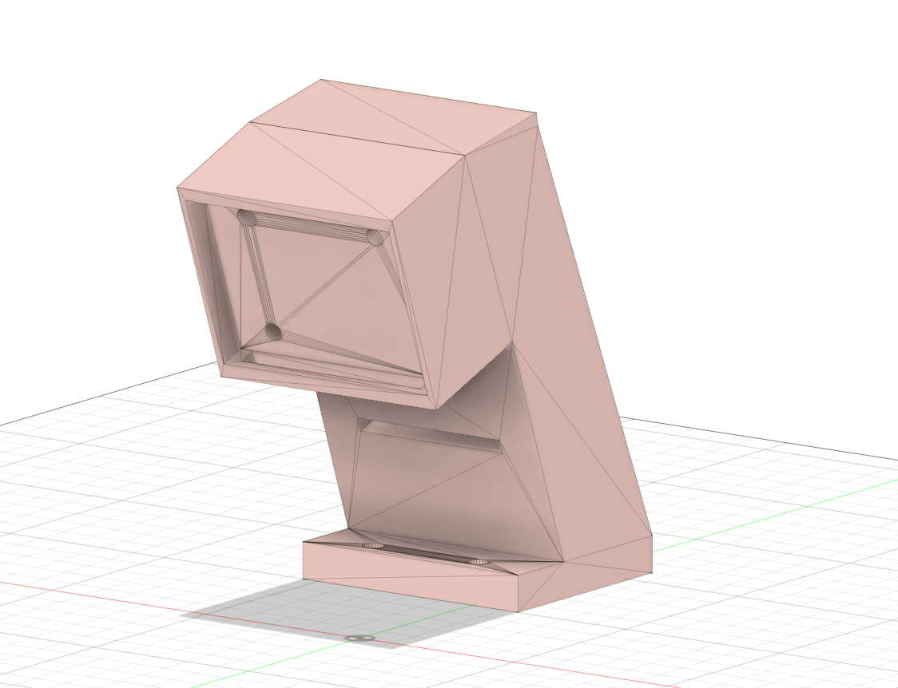

# Camera Mount

Holds the Camera Module 3 at the front of the car, above the chassis.

**Height is the whole point of this part.** The higher the camera sits, the earlier it
sees a traffic sign, and the more distance the robot has to plan a way around it rather
than react to it.

**Rigidity is the second requirement.** We estimate how far away a sign is from how
tall it appears in the frame. A mount that sags under its own weight, or vibrates while
the motor runs, changes that apparent height and therefore reports the wrong distance.
Because the error is systematic rather than random, it does not average out.

| File | Format |
|---|---|
| `camera_mount.stl` | STL, print ready |

<!-- TODO: fill in
| Property | Value |
|---|---|
| Camera height above the mat | |
| Camera tilt angle | |
| Material | |
| Layer height | |
| Infill | |
-->
