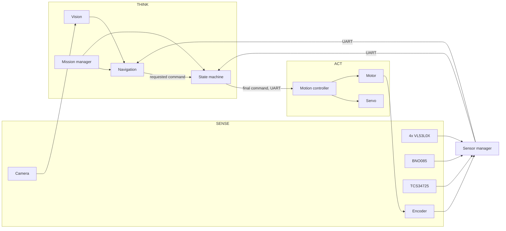

# Systems Thinking

How the subsystems work together, and what happens at the boundaries between them.

Covers rubric criterion 4, alongside [design-decisions.md](design-decisions.md) for
constraints, trade-offs and risk, and [iteration-log.md](iteration-log.md) for the
testing cycles.

## Subsystem Map

Note the loop at the bottom. The motor drives the wheels, the wheels turn the encoder,
the encoder reports back, and that is how the robot knows whether its own command
actually did anything. Without it, stall detection is impossible.

## How Each Pair Interacts

| From | To | What crosses | Why it is shaped that way |
|---|---|---|---|
| Camera | Vision | Raw frame | |
| Vision | Navigation | A list of signs with colour, position and distance | A list rather than one sign, so navigation can choose which matters |
| Sensors | Sensor manager | Individual readings | Each may be `None` independently |
| Sensor manager | Pi | One text line over UART | Plain text so it can be read with any serial terminal when debugging |
| Mission manager | Navigation and state machine | One string | Asked every frame, so automatic detection can replace it later |
| Navigation | State machine | A requested speed and steering | A request, not an instruction |
| State machine | Motion controller | The final command | The only command that reaches the wheels |
| Motion controller | Servo and motor | Duty values | Each device's own module owns its clamping |
| Motor | Encoder | Physical rotation | Closes the loop |

## The Three Boundaries That Matter Most

### Navigation to state machine: request versus authority

Navigation decides **how** to drive. The state machine decides **what** we are doing, and
may only restrain navigation's request, never invent one.

This split exists because the two questions have different answers at different rates.
How to steer around a sign changes every frame. Whether we are avoiding a sign at all
changes every few seconds.

Merging them was our first design, and it produced code where a change to cornering
accidentally affected sign avoidance, because both lived in the same conditionals.

### Pi to Pico: the timing boundary

This is the most important boundary in the system, and it is drawn on timing rather than
on function.

The Pi can pause. Linux may stall a loop for tens of milliseconds. The Pico cannot pause,
because nothing else is running on it.

Everything with a deadline is therefore on the far side of that boundary: PWM
generation, encoder counting, and the safety stop. The consequence is that **the Pi
crashing does not mean the robot keeps driving**, because the thing that stops it lives
on the other board.

### Vision to navigation: units and coordinates

Vision works in centimetres and pixels. Navigation works in millimetres and a normalised
frame offset from -1 to +1.

The conversion happens once, explicitly, in `main.py`. Neither module guesses. Unit
mismatches across a module boundary are a classic way to lose a robot, and the fix is to
make the boundary the only place a conversion happens.

## Failure Propagation

What we designed so that one subsystem failing does not take the others with it.

| If this fails | What happens | What does not happen |
|---|---|---|
| One distance sensor | That reading is `None`, navigation slows | The other three keep working |
| The camera | No signs detected, robot follows the lane | It does not stop or crash |
| The IMU | Corners complete on timeout instead of heading | Driving continues |
| One sensor driver file missing | That sensor reports itself by name | The other five keep working |
| The Pi | Watchdog stops the robot after 500 ms | It does not drive on uncommanded |
| The serial link | Robot stops, Pi keeps retrying | The program does not exit |
| A camera frame | Skipped | The loop does not stall |

The pattern throughout: **degrade rather than stop, and never stop silently.**

## Where the Subsystems Fought Each Other

Three cases where two individually correct subsystems produced a wrong outcome together.
These are the interactions that only appear once things are integrated.

**Emergency stop against cornering.** Navigation stops for a close wall. The state
machine turns towards a wall during a corner. Together, the robot froze mid corner, the
turn never completed, and it timed out into a recovery that could not clear. Fixed with a
minimum speed for the cornering state.

**Emergency stop against parking.** The same shape of problem. The parking trigger sat
at 120 mm but the emergency stop fired at 150 mm, so the robot could never physically
reach its own trigger. Fixed with a minimum speed and a threshold below the stop line,
plus an assertion that enforces the ordering.

**Vision against parking.** Red detection and magenta detection overlapped on the hue
circle, so the parking lot was seen as one enormous traffic sign and the robot tried to
pass it on the right. Fixed by narrowing the red band.

None of these were visible in any single module. All three needed the modules running
together.
