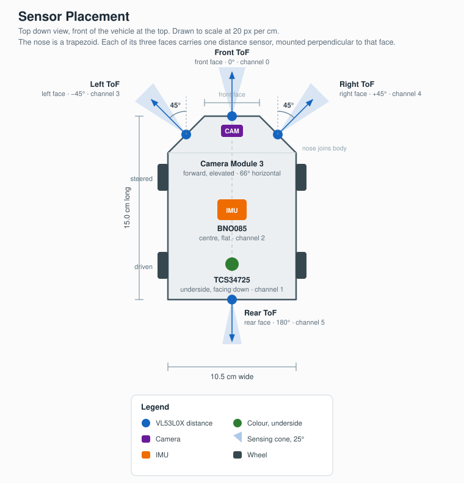

# Electrical Components and Wiring

## Contents

1. [System Architecture](#system-architecture)
2. [Component List](#component-list)
3. [Design Rationale](#design-rationale)
4. [Master Connection and PCB Routing List](#master-connection-and-pcb-routing-list)

---

## System Architecture

Compute is split across two boards. The **Raspberry Pi 3** is the high level brain,
handling anything that needs an operating system. The **Pico 2 W** is the low level
brainstem, handling anything with a deadline.

### What the Pi 3 is responsible for

**Computer vision.** The Camera Module 3 connects directly to the Pi 3, because
processing a live video feed needs the CPU, RAM and filesystem that a microcontroller
does not have. The Pi runs the detection pipeline that finds red and green traffic
signs, the black wall, and the magenta parking markers, and estimates the distance to
each from its known real height.

**Navigation and planning.** The Pi ingests the sensor readings the Pico sends over
UART, combines them with what the camera sees, and decides how to drive. Separate
steering laws handle lane following, sign passing, cornering and parking.

**Competition behaviour.** An event driven state machine tracks what the robot is
currently doing across twelve states and three missions, and has the final say on the
command that gets sent to the Pico.

**Telemetry.** During testing the Pi prints a status block per frame and can draw the
camera view with detections overlaid, which is how the vision thresholds get tuned.

### What the Pico 2 W is responsible for

Linux is not a real time operating system. A background process, a filesystem sync or a
Wi-Fi interrupt can stall a Python loop for tens of milliseconds, which is long enough
to make steering twitchy or leave a wheel spinning unchecked. The Pico runs a dedicated
loop instead, so these functions never get starved by the vision stack.

**Sensor harvesting.** The Pico manages the TCA9548A multiplexer, opening one channel
at a time to read the four distance sensors, the IMU and the colour sensor, then
packaging the readings into a single line of text and streaming it to the Pi.

**Actuation.** It generates the 50 Hz PWM the MG90S servo needs to hold a steering
angle without jitter, and the 20 kHz PWM that drives the DRV8833. The higher frequency
is above hearing, so the motor does not whine.

**Odometry.** The GA12-N20's encoder produces thousands of pulses per minute. The Pico
counts every one on a hardware interrupt, so pulses are never dropped even while the
main loop is busy elsewhere.

---

## Component List

<!-- TODO for each component:
       1. add a photo and fix the image path
       2. fill in the electrical values
     These are the ELECTRICAL specifications. Mechanical dimensions and
     performance figures live in the main README, so each number has one home. -->

### Raspberry Pi 3 Model B

| Specification | Value |
|---|---|
| Supply voltage | |
| Typical current draw | |
| Peak current draw | |
| Logic level | |
| Interface to Pico | |
| Camera interface | |

### Raspberry Pi Pico 2 W

| Specification | Value |
|---|---|
| Supply voltage (VSYS) | |
| Typical current draw | |
| Logic level | |
| 3.3 V rail output current available | |
| PWM channels used | |
| I2C bus used | |

### Camera Module 3

| Specification | Value |
|---|---|
| Supply | |
| Connector type | |
| Cable required for Pi 3 | |
| Resolution used | |
| Frame rate used | |

### GA12-N20 Gear Motor with Encoder

| Specification | Value |
|---|---|
| Rated voltage | |
| No load current | |
| Stall current | |
| Encoder supply voltage | |
| Encoder output type | |
| Encoder pulses per motor revolution | |

### MG90S Servo

| Specification | Value |
|---|---|
| Supply voltage | |
| Idle current | |
| Stall current | |
| Signal voltage accepted | |
| PWM frequency | |
| Pulse width range used | |

### DRV8833 Motor Driver

| Specification | Value |
|---|---|
| Motor supply (VM) range | |
| Continuous current per channel | |
| Peak current per channel | |
| Logic input voltage | |
| PWM frequency used | |
| nSLEEP handling | |

### VL53L0X Time of Flight Sensor (x4)

| Specification | Value |
|---|---|
| Supply voltage | |
| Current draw, per sensor | |
| I2C address | |
| Bus speed | |
| Multiplexer channels used | |
| XSHUT handling | |

### TCA9548A I2C Multiplexer

| Specification | Value |
|---|---|
| Supply voltage | |
| I2C address | |
| Number of channels | |
| Channels used | |
| Pull-up resistors fitted | |

### BNO085 IMU

| Specification | Value |
|---|---|
| Supply voltage | |
| Current draw | |
| I2C address | |
| Multiplexer channel | |
| Protocol select pins (PS0, PS1) | |

### TCS34725 Colour Sensor

| Specification | Value |
|---|---|
| Supply voltage | |
| Current draw | |
| I2C address | |
| Multiplexer channel | |
| Onboard LED control | |

### Mini560 Buck Converter

| Specification | Value |
|---|---|
| Input voltage range | |
| Output voltage | |
| Continuous output current | |
| Peak output current | |
| Efficiency | |

### Battery

| Specification | Value |
|---|---|
| Chemistry | 2S1P LiPo |
| Nominal voltage | 7.4 V |
| Capacity | 1500 mAh |
| Discharge rating | 35C |
| Stored energy | |
| Measured run time | |

---

## Design Rationale

Why these specific parts, rather than the alternatives.

### Compute and Control

Splitting compute across two boards was a deliberate choice rather than a default. A
single Pi could technically run everything, including the servo and motor PWM, but the
timing problem described above makes that unreliable in exactly the moments that
matter. Offloading motor control, encoder counting and the safety cutoff to the Pico
means those functions keep running no matter how busy the Pi gets processing camera
frames. The trade is extra wiring and a UART link to keep the two boards in sync, which
we accepted in exchange for control loops that never get starved.

### Drivetrain

The GA12-N20 6 V gearmotor was chosen for its combination of small size, integrated
gearbox and onboard encoder. **The encoder is the deciding factor.** It lets the Pico
measure actual wheel rotation instead of assuming a PWM duty cycle maps cleanly to
speed, and without it the robot cannot tell that it is stalled. Stall detection is what
triggers the recovery behaviour, so a robot without odometry that gets wedged against a
wall will sit there until the round ends.

Theoretical top speed follows the relation between wheel circumference and output shaft
revolutions per minute, but that ignores load, friction and battery sag, so we treat it
as a ceiling and tune the operating PWM experimentally instead.

The DRV8833 drives it, picked over bulkier options like the L298N for its smaller
footprint and much better efficiency at the low voltages this build runs at. It handles
both direction and speed while isolating the motor's current draw from the logic pins
on the Pico.

Steering uses the MG90S servo rather than a second drive motor or a rack and pinion
setup, since a servo gives direct, repeatable angle control in a small package. Its
signal comes straight from the Pico, so steering response stays independent of whatever
the Pi is doing with the camera feed. The metal gear train also survives clipping a
wall, which is the failure mode that destroys plastic geared servos.

### Power System

The robot runs on a 7.4 V, 1500 mAh, 35C, 2S1P LiPo, giving roughly 11 Wh of stored
energy.

One deliberate choice here: the DRV8833's motor supply taps the raw battery voltage
directly, in parallel with the buck converter's input, rather than running off the
regulated 5 V rail. That gives the motor more voltage headroom, at the cost of
overdriving a 6 V rated motor if it were ever run at 100 percent duty, which is why the
PWM duty is software limited rather than left uncapped. In exchange, motor current
never passes through the regulated logic rail at all, so current spikes cannot sag the
voltage feeding the Pi, the Pico or the sensors.

The Mini560 handles the regulated 5 V side that powers the Pi 3, the Pico and the
servo. The peak draw is what sizes it: the Pi alone can pull 2.5 A, and the servo adds
up to 1.5 A at stall, which happens exactly when the robot is steering hard.

### Logic Levels

**Every sensor output runs at 3.3 V.** The RP2350 is not 5 V tolerant, with an absolute
maximum of 3.3 V plus 0.3 V on any GPIO pin. This is why the N20 encoder is supplied
from the Pico's 3.3 V rail rather than the 5 V rail. A magnetic encoder outputs at
whatever voltage supplies it, so a 5 V supply would have put 5 V logic straight into
GP12 and GP13. That fault would have worked on the bench and destroyed the
microcontroller days later, which is the hardest kind of fault to diagnose because it
looks like a software bug.

### Sensor Placement

### Distance and Environmental Sensing

Four VL53L0X time of flight sensors sit across the front and back of the chassis rather
than one, so the robot gets several simultaneous readings across its field of travel
instead of a single point measurement.

The front of the chassis is a trapezoid, and its three faces each carry one sensor
mounted perpendicular to that face. That geometry is what produces the 0 and plus or
minus 45 degree angles directly, with no brackets or shims, and a sensor sitting flat
against a flat face aligns far more repeatably than one held at an angle. The two
angled sensors therefore watch the forward diagonals and see an approaching corner
while there is still room to react.

All VL53L0X units share the same default I2C address, and so does the TCS34725, which
is a problem the moment you want more than one on a bus. Rather than reflashing each
sensor's address individually, a TCA9548A multiplexer sits between the Pico and the
sensor network, giving each device its own isolated channel. That uses six of the eight
channels, leaving two free for future additions without rewiring anything.

### Orientation and Colour Sensing

The BNO085 IMU adds orientation data that neither the encoder nor the camera can
provide on their own, and it is particularly useful mid turn, where wheel odometry
alone drifts. It runs sensor fusion on its own processor rather than handing over raw
accelerometer and gyroscope values to filter.

The TCS34725 exists so that colour detection does not depend entirely on the camera. It
gives a direct, low overhead reading that the Pico can act on quickly, while the camera
handles the spatial side of track interpretation on the Pi. Its built in infrared filter
is what keeps it stable while four infrared distance sensors are firing beside it.

It is mounted on the underside of the nose, directly below the camera mount. Sitting at
the front rather than under the middle of the car means the sensor crosses a corner line
before the wheels do, which gives the robot more time to react. Sharing the camera mount
also means the two front facing sensors stay aligned with each other.

The IMU, by contrast, sits toward the rear. Yaw is a property of the whole vehicle
rather than of a point on it, so the heading reading is the same wherever the sensor is
mounted. That let us put it where there was flat, rigid space, behind the drive assembly
and away from the crowded nose.

### Vision System

The Camera Module 3 is the primary visual sensor and the only one that can distinguish
red from green. It is also the only sensor that sees far enough ahead to plan a
manoeuvre rather than react to one.

The Pi 3 has a single 15 pin CSI connector, so the camera uses a standard 15 pin ribbon
cable. The 15 to 22 pin adapter sold for Camera Module 3 is for the newer boards with
narrower connectors and does not fit a Pi 3.

---

## Master Connection and PCB Routing List

> Header pins referenced below (2/4 = 5V, 6 = GND, 8 = GPIO14/TXD, 10 = GPIO15/RXD)
> are identical across all 40-pin Raspberry Pi boards.

### 1. Power Distribution Bus
- Battery Positive (+) ➡️ Mini560 IN(+) AND DRV8833 VM (Motor Power Input).
- Battery Negative (-) ➡️ Mini560 IN(-) (Establishes the main system GND rail).
- Mini560 OUT(+) [5V Rail] ➡️ Pico 2 W Pin 39 (VSYS) AND Pi 3 Pin 2/4 (5V) AND MG90S Servo Red (VCC).
  - **The N20 encoder must NOT sit on this rail.** Its A/B outputs swing to whatever voltage supplies it, and the RP2350 GPIOs are not 5V tolerant (absolute max 3.3V + 0.3V). Encoder VCC goes to the 3V3 rail below.
- Mini560 OUT(-) [GND Plane] ➡️ Pico Pin 38 (GND) AND Pi 3 Pin 6 (GND) AND Servo Brown (GND) AND Encoder GND AND DRV8833 GND. Flood the entire bottom layer of the PCB as a solid ground plane to connect these seamlessly.
- Pico Pin 36 (3V3 OUT Rail) ➡️ VCC / VIN pins of the TCA9548A, BNO085, TCS34725, and all 4x VL53L0X sensors, **plus N20 Encoder VCC and DRV8833 nSLEEP**.
  - Encoder VCC here, not on 5V, so the A/B outputs are 3.3V logic. It draws a few mA.
  - nSLEEP (labelled SLP or EEP on most breakouts) must be high or the driver stays asleep and the motor does nothing while the code reads perfectly correct. Some breakouts pull it high on-board, so check yours before adding the trace.
- **Decoupling:** 100 µF electrolytic across DRV8833 VM/GND, placed at the driver. Motor current spikes otherwise drag the shared 5V rail down far enough to reset the Pico mid-run.

### 2. High-Level Logic Interconnects
- Pico Pin 1 (GP0 / TX) ➡️ Pi 3 GPIO Pin 10 (RXD0 / GPIO 15)
- Pico Pin 2 (GP1 / RX) ➡️ Pi 3 GPIO Pin 8 (TXD0 / GPIO 14)
  - Pi 3 only: `/dev/serial0` defaults to the mini-UART, whose baud rate drifts with CPU load and corrupts bytes once the vision code is running. Set `enable_uart=1` and `dtoverlay=disable-bt` in config.txt, then confirm `ls -l /dev/serial0` resolves to **ttyAMA0**, not ttyS0.
- Camera Module 3 ➡️ Connects directly to the Pi 3's single 15-pin CSI port via a standard 15-pin ribbon cable. The 15-to-22 pin cable is for the newer boards with narrower connectors and does not fit a Pi 3. (Does not wire to the Pico 2 W.)

### 3. Sensor I2C Network
- Pico Pin 6 (GP4 / SDA) ➡️ TCA9548A SDA (add a 4.7kΩ pull-up resistor to the 3.3V trace).
- Pico Pin 7 (GP5 / SCL) ➡️ TCA9548A SCL (add a 4.7kΩ pull-up resistor to the 3.3V trace).
- TCA9548A CH0 (SD0 / SC0) ➡️ VL53L0X Distance Sensor #1 (SDA / SCL)
- TCA9548A CH1 (SD1 / SC1) ➡️ TCS34725 Color Sensor (SDA / SCL)
- TCA9548A CH2 (SD2 / SC2) ➡️ BNO085 IMU Sensor (SDA / SCL)
- TCA9548A CH3 (SD3 / SC3) ➡️ VL53L0X Distance Sensor #2 (SDA / SCL)
- TCA9548A CH4 (SD4 / SC4) ➡️ VL53L0X Distance Sensor #3 (SDA / SCL)
- TCA9548A CH5 (SD5 / SC5) ➡️ VL53L0X Distance Sensor #4 (SDA / SCL)
- Note: leave all VL53L0X XSHUT pins completely disconnected on the PCB, since they pull high naturally.

### 4. Drivetrain Control (Motors, Encoders, & Servos)
- Pico Pin 29 (GP22) ➡️ MG90S Servo Orange (Signal Pin). Bypasses the driver entirely.
- Pico Pin 11 (GP8) ➡️ DRV8833 IN1 (Motor Drive Forward PWM)
- Pico Pin 12 (GP9) ➡️ DRV8833 IN2 (held low for forward; carries the PWM for reverse)
  - A DRV8833 has no dedicated direction pin. Whichever of IN1/IN2 carries the PWM is the direction, and the duty on it is the speed. GP8 and GP9 are the two halves of PWM slice 4, so they share a frequency, which suits reverse fine since both want the same 20 kHz.
- DRV8833 OUT1 / OUT2 ➡️ GA12-N20 Motor Pin 1 & Pin 2 (Motor Power Leads)
  - Solder a 0.1 µF ceramic across the two motor terminals. Brush noise otherwise couples into the encoder lines and shows up as phantom counts that appear only under motor power.
- GA12-N20 Motor Pin 5 (Encoder A) ➡️ Pico Pin 16 (GP12)
- GA12-N20 Motor Pin 6 (Encoder B) ➡️ Pico Pin 17 (GP13)
  - Route both encoder traces away from the thick motor leads, for the same reason.

